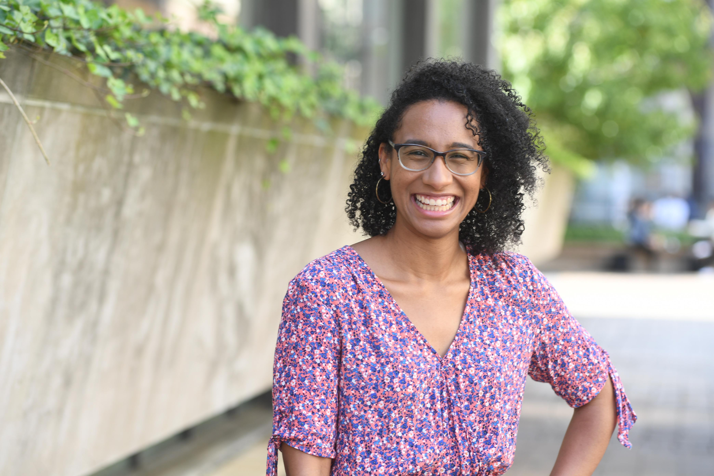

Hello and welcome! I am a PhD candidate at the Lamont-Doherty Earth Observatory of Columbia University in the City of New York. 

Prior to beginning my PhD, I earned my MS at the School of Marine and Atmospheric Science at Stony Brook University where my research focused on global climate model ability to simulate the extent of precipitation associatd with the North American monsoon.

My academic journey began in the Northeast Kingdom of Vermont where I got my BS in Atmospheric Science from Northern Vermont University (formerly Lyndon State College).
